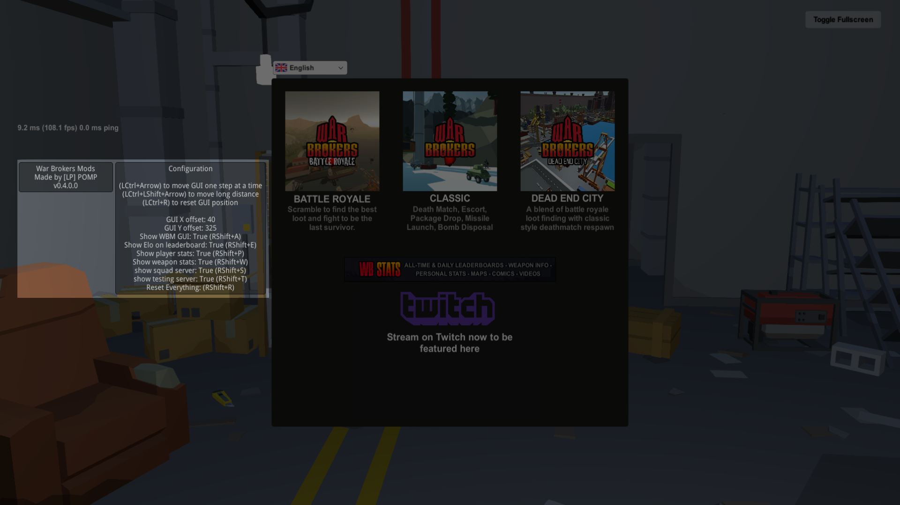

# [War Brokers Mods (WBM)](https://github.com/War-Brokers-Mods/WBM)


[](https://discord.gg/aQqamSCUcS)

> **IF YOU USE THIS TO DEVELOP HACKS YOUR MOM IS GAY.**

<p align="center">
  
</p>

**W**ar **B**rokers **M**ods, AKA **WBM** is a unofficial mod for [War Brokers](https://store.steampowered.com/app/750470).<br />

<details>
<summary>Example Images (click to unfold)</summary>




</details>

## Installation

Only Windows, MacOS, and Linux are officially supported. It is Not compatible with browsers.

> **WARNING**<br />
> I do not upload WBM anywhere other than github. If you find it elsewhere, IT IS NOT UPLOADED BY ME.

### 1. Install BepInEx

1. Download the latest version of BepInEx **version 5** from [here](https://github.com/BepInEx/BepInEx/releases).

   |      Platform | Filename                      |
   | ------------: | :---------------------------- |
   | Linux & MacOS | BepInEx_unix\_**5**.Y.Z.W.zip |
   |       Windows | BepInEx_x86\_**5**.Y.Z.W.zip  |

2. Extract (Unzip) the content**s** to where the game executable is located.

   How to find game location:
   

3. If you are using Linux or MacOS, you must also perform the following setup:

   https://docs.bepinex.dev/v5.4.11/articles/advanced/steam_interop.html

4. **[ IMPORTNT ]** Run the game at least once to generate the plugins folder as well as other necessary files.

### 2. Install WBM

1. [Download](https://github.com/War-Brokers-Mods/WBM/releases/latest) the latest version of WBM. (`WBM.zip` file)
2. Unzip it in the `<Game folder>/BepInEx/plugins` folder.

   It should look like this:

   ```
   plugins
   └── WBM
       ├── assets
       │   └── audio
       │       └── ...
       └── WBM.dll
   ```

### 3. Set up OBS (optional)

1. [Download](https://github.com/War-Brokers-Mods/WBM-Overlays/archive/refs/heads/master.zip) the overlays and Unzip it anywhere. (Source code can be found [here](https://github.com/War-Brokers-Mods/WBM-Overlays))
2. Create a new browser source in OBS studio.

   

3. Check the `Local file` checkbox and use a `.html` file of the overlay you want to use. Width and height of the overlays can be found [here](#obs-overlays).

   

### Updating

Simply go through the installation process again and replace existing files. You don't have to reinstall BepInEx to reinstall WBM.

## Usage

- Hold down <kbd>LCtrl</kbd> or <kbd>RShift</kbd> to show shortcuts in-game.

| Function                             | Shortcut                                            |
| ------------------------------------ | --------------------------------------------------- |
| Move GUI by one pixel at a time      | <kbd>LCtrl</kbd>+<kbd>Arrow</kbd>                   |
| Move GUI (long press)                | <kbd>LCtrl</kbd>+<kbd>LShift</kbd>+<kbd>Arrow</kbd> |
| Reset GUI position                   | <kbd>LCtrl</kbd>+<kbd>R</kbd>                       |
| <br />                               |                                                     |
| Toggle All GUI visibility            | <kbd>RShift</kbd>+<kbd>A</kbd>                      |
| Toggle Player statistics visibility  | <kbd>RShift</kbd>+<kbd>P</kbd>                      |
| Toggle Weapon statistics visibility  | <kbd>RShift</kbd>+<kbd>W</kbd>                      |
| Toggle Team statistics visibility    | <kbd>RShift</kbd>+<kbd>L</kbd>                      |
| Toggle Elo visibility on leaderboard | <kbd>RShift</kbd>+<kbd>E</kbd>                      |
| Squad server visibility              | <kbd>RShift</kbd>+<kbd>S</kbd>                      |
| Testing servers visibility           | <kbd>RShift</kbd>+<kbd>T</kbd>                      |
| <br />                               |                                                     |
| Toggle shift to crouch               | <kbd>RShift</kbd>+<kbd>C</kbd>                      |
| <br />                               |                                                     |
| Reset everything                     | <kbd>RShift</kbd>+<kbd>R</kbd>                      |

## Features

### in-game overlays

- Tab Leaderboard

  - show kills Elo

- Player statistics

  - KDR
  - kills Elo
  - kills Elo earned/lost
  - games Elo
  - games Elo earned/lost
  - total damage dealt
  - longest kill
  - points earned

- Weapon statistics

  - total headshot count

### OBS overlays

- kills and games Elo (size: 355x140)


<!--
- top player per criteria (kills, longest kills, points, etc.)
- kill streak
- hit accuracy
- game mode
- team score
- server id
- streamer ID
- survivors left in a BR match
- teammate name
- played game history (win, lose, and by how much)
- ping in millisecond per player
- if a player is a bot or not
- Daily and history record
-->

### Controls

- Shift to crouch

# Building

If you are a casual user, this is completely unnecessary. **This is only recommended for developers.**

> Assumes that working directory is project root.

1. Install .NET sdk.
2. Clone this repository.
3. Copy all DLL files from `<WB install path>/war_brokers_Data/Managed/` to `./WBM/dll/`. Create directory if it does not exist.
4. Create `scripts/config.sh`.

   ```bash
   #!/bin/bash

   WB_PLUGINS_DIR="<PATH_TO_PLUGINS_DIRECTORY_HERE>"
   ```

5. Now you can run the scripts.

   - `scripts/debug.sh`: Build WBM in debug mode and copy the files to the plugins directory.
   - `scripts/release.sh`: Create a zip file that can be uploaded in the gh release section.

## Bug reports / Suggestions

If you have a cool idea that will make WBM better, or if WBM misbehaves in any way (no matter how minor the problem is), feel free go to the [Issues page](https://github.com/War-Brokers-Mods/WBM/issues) and open a new issue!

## Contributing

- use GH pull request
- use vscode and install [recommended extensions](.vscode/extensions.json). This is required for code formatting.

## Special thanks

- [inorganik](https://github.com/inorganik) for [countUp.js](https://github.com/inorganik/countUp.js)
- [l3lackShark](https://github.com/l3lackShark) for [inspiration](https://github.com/l3lackShark/gosumemory)
- [jassper0](https://github.com/jassper0) for [Elo overlay design](https://github.com/l3lackShark/static/tree/master/Simplistic)

## License

This project is licenced under the [MIT License](https://opensource.org/licenses/MIT).

Fonts:

- https://fonts.google.com/specimen/Architects+Daughter : OFL (used in WBM logo)
