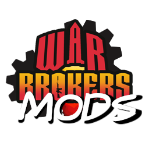

# [War Brokers Mods (WBM)](https://github.com/War-Brokers-Mods/WBM)


[](https://discord.gg/aQqamSCUcS)

> **IF YOU USE THIS TO DEVELOP HACKS YOUR MOM IS GAY.**

<p align="center">
  
</p>

**W**ar **B**rokers **M**ods, AKA **WBM** is a unofficial mod for [War Brokers](https://store.steampowered.com/app/750470).<br />

<details>
<summary>Example Images (click to unfold)</summary>


</details>

## Installation

Only Windows, MacOS, and Linux are officially supported. It is Not compatible with browsers.

> **WARNING**<br />
> I do not upload WBM anywhere other than github. If you find it elsewhere, IT IS NOT UPLOADED BY ME.

### 1. Install BepInEx

1.  Download the latest version of BepInEx **version 5** from [here](https://github.com/BepInEx/BepInEx/releases). It is important that you download the right version.

    |      Platform | Filename                      |
    | ------------: | :---------------------------- |
    | Linux & MacOS | BepInEx\_**unix_5**.Y.Z.W.zip |
    |       Windows | BepInEx\_**x86_5**.Y.Z.W.zip  |

2.  Extract (Unzip) the content**S** to where the game is installed.

    How to find game location:<br />
    

    The folder structure should look like this after unzipping file:

    ```
    WarBrokers/
    ├── BepInEx/
    │  ├── core/
    │  └ other files...
    └ other files...
    ```

3.  If you are using Linux or MacOS, you must also perform the following setup:

    1. make `run_bepinex.sh` executable: `chmod u+x run_bepinex.sh`
    2. Add launch option

       where to find game properties:<br />
       

       If you're on linux, set the launch option to:

       ```bash
       ./run_bepinex.sh %command%
       ```

       If you're on Mac, open a terminal in the game folder and run

       ```bash
       pwd
       ```

       This will print the full path to the game folder. Copy it. Next, set launch option to

       ```bash
       "PUT_RESULT_FROM_PWD_HERE/run_bepinex.sh" %command%
       ```

4.  Run the game at least once to generate the plugins folder as well as other necessary files.

### 2. Install WBM

1. [Download](https://github.com/War-Brokers-Mods/WBM/releases/latest) the latest version of WBM. (`WBM.zip` file)
2. Unzip it in the `<Game folder>/BepInEx/plugins` folder.

   It should look like this:

   ```
   plugins (in the BepInEx folder)
   └── WBM
       ├── assets
       │   └── audio
       │       └── ...
       └── WBM.dll
   ```

### 3. Set up OBS (optional)

1. [Download](https://github.com/War-Brokers-Mods/WBM-Overlays/archive/refs/heads/master.zip) the overlays and Unzip it anywhere. (Source code can be found [here](https://github.com/War-Brokers-Mods/WBM-Overlays))
2. Create a new browser source in OBS studio.

   

3. Check the `Local file` checkbox and use a `.html` file of the overlay you want to use. Width and height of the overlays can be found [here](#obs-overlays).

   

### Updating

Simply go through the installation process again and replace existing files. You don't have to reinstall BepInEx to reinstall WBM.

## Usage

### Default shortcuts

- Hold down <kbd>LCtrl</kbd> or <kbd>RShift</kbd> to show shortcuts in-game.
- Press F1 to show menu. Press outside the menu to close.

| Function                             | Default Shortcut                                    |
| ------------------------------------ | --------------------------------------------------- |
| Show Menu                            | <kbd>F1</kbd>                                       |
| <br />                               |                                                     |
| Move GUI                             | <kbd>LCtrl</kbd>+<kbd>LShift</kbd>+<kbd>Arrow</kbd> |
| Move GUI by one pixel                | <kbd>LCtrl</kbd>+<kbd>Arrow</kbd>                   |
| Reset GUI position                   | <kbd>LCtrl</kbd>+<kbd>R</kbd>                       |
| <br />                               |                                                     |
| Toggle All GUI visibility            | <kbd>RShift</kbd>+<kbd>A</kbd>                      |
| Toggle Player statistics visibility  | <kbd>RShift</kbd>+<kbd>P</kbd>                      |
| Toggle Weapon statistics visibility  | <kbd>RShift</kbd>+<kbd>W</kbd>                      |
| Toggle Team statistics visibility    | <kbd>RShift</kbd>+<kbd>L</kbd>                      |
| Toggle Elo visibility on leaderboard | <kbd>RShift</kbd>+<kbd>E</kbd>                      |
| Squad server visibility              | <kbd>RShift</kbd>+<kbd>S</kbd>                      |
| Testing servers visibility           | <kbd>RShift</kbd>+<kbd>T</kbd>                      |
| Kill streak sound effect             | <kbd>RShift</kbd>+<kbd>F</kbd>                      |
| Clear chat                           | <kbd>RShift</kbd>+<kbd>Z</kbd>                      |
| Clear Messages (kills and death log) | <kbd>RShift</kbd>+<kbd>X</kbd>                      |
| <br />                               |                                                     |
| Toggle shift to crouch               | <kbd>RShift</kbd>+<kbd>C</kbd>                      |

#### Warning

The order of keystroke matter. For example, pressing <kbd>RShift</kbd>+<kbd>A</kbd> is different from pressing <kbd>A</kbd>+<kbd>RShift</kbd>. This is to prevent situation where <kbd>RShift</kbd>+<kbd>A</kbd> fires when the user intended to press <kbd>LCtrl</kbd>+<kbd>RShift</kbd>+<kbd>A</kbd>.

## Features

- in-game menu
- reconfigure shortcut keys
- clear chat
- clear game messages (kills, deaths, missile launch, bomb diffuse, etc.)
- Extended fps limit (5~240 => disabled~1000)

### in-game overlays

- Tab Leaderboard

  - show kills Elo

- Player statistics

  - KDR
  - kills Elo
  - kills Elo earned/lost
  - games Elo
  - games Elo earned/lost
  - total damage dealt
  - longest kill
  - points earned
  - headshot count
  - kill streak

- Weapon statistics

  - fire timer
  - reload timer
  - cooldown timer
  - bullet speed
  - current zoom

- Team statistics

  - in-game nick
  - kdr
  - points earned
  - damage dealt
  - total damage dealt
  - total deaths
  - total kills

### Controls

- Shift to crouch

### Sound effects

- 10 kill streak: "rampage"
- 20 kill streak: "killing spree"
- 30 kill streak: "unstoppable"
- 50 kill streak: "godlike"
- 69 kill streak: "nice"

### OBS overlays

- kills and games Elo (size: 355x140)


### Etc

- persistent configuration
- kill streak sound effect
- Quickly change settings with keyboard shortcut

## Limitations

WBM is not a hack. WBM will not include any features that will give unfair advantage. These features include but not limited to: extended minimap zoom, quick weapon swap, instant zoom, extended field of view, audio filter, etc.

WBM will not include any custom skins. Micro-transaction accounts for a significant portion of the developers' income and WBM will not include any feature that will damage it.

## Building

If you are a casual user, this is completely unnecessary. **This is only recommended for developers.**

> Assumes that working directory is project root.

1. Install .NET sdk.
2. Clone this repository.
3. Copy all DLL files from `<WB install path>/war_brokers_Data/Managed/` and `<WB install path>/BepInEx/core` to `WBM/dll/`. Create directory if it does not exist.
4. Download [BepInEx configuration manager v16](https://github.com/BepInEx/BepInEx.ConfigurationManager/releases) and put the dll file in `WBM/dll` directory. Other file(s) in the zip file can be deleted.
5. Create `scripts/config.sh`.

   ```bash
   #!/bin/bash

   WB_PLUGINS_DIR="<PATH_TO_PLUGINS_DIRECTORY_HERE>"
   ```

6. Now you can run the scripts.

   - `scripts/debug.sh`: Build WBM in debug mode and copy the files to the plugins directory.
   - `scripts/release.sh`: Create a zip file that can be uploaded in the gh release section.

## Bug reports / Suggestions

If you have a cool idea that will make WBM better, or if WBM misbehaves in any way (no matter how minor the problem is), feel free go to the [Issues page](https://github.com/War-Brokers-Mods/WBM/issues) and open a new issue!

## Contributing

- use GH pull request
- use vscode and install [recommended extensions](.vscode/extensions.json). This is required for code formatting.

## Special thanks

- [inorganik](https://github.com/inorganik) for [countUp.js](https://github.com/inorganik/countUp.js)
- [l3lackShark](https://github.com/l3lackShark) for [inspiration](https://github.com/l3lackShark/gosumemory)
- [jassper0](https://github.com/jassper0) for [Elo overlay design](https://github.com/l3lackShark/static/tree/master/Simplistic)

## License

This project is licenced under the [MIT License](https://opensource.org/licenses/MIT).

Fonts:

- https://fonts.google.com/specimen/Architects+Daughter : OFL (used in WBM logo)
